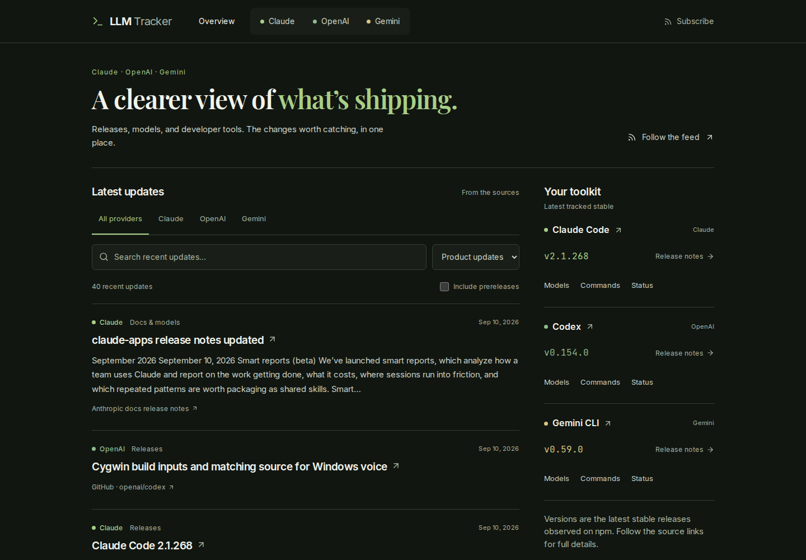
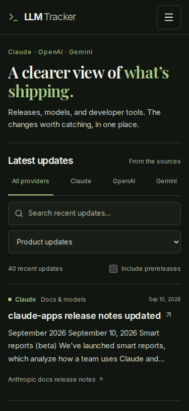
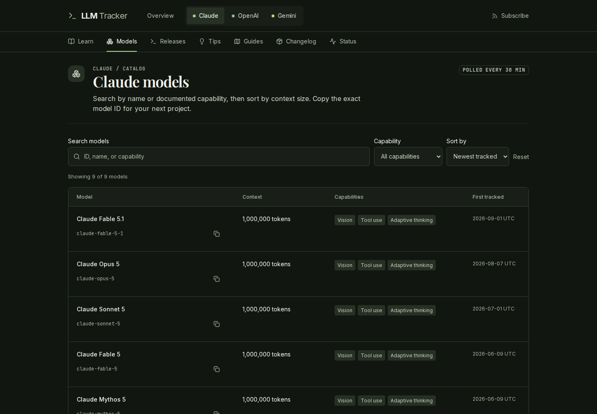
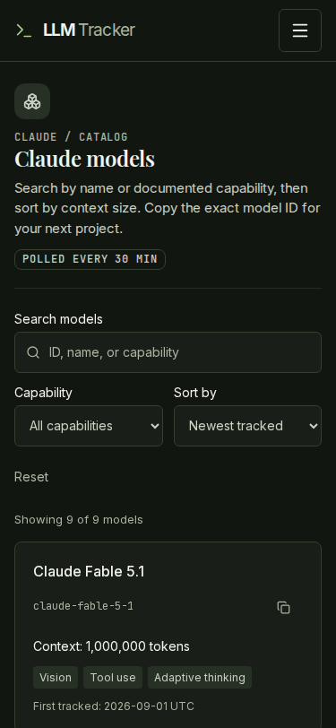

# Dashboard verification

The activity-first dashboard, provider navigation, searchable command reference,
and model discovery controls were checked on September 11, 2026. Screenshots use
an isolated production build and a disposable database reconstructed from public
RSS, catalog, and reference output. They demonstrate UI behavior, not current
provider facts, catalog completeness, ingestion health, or production deployment.

| Check | Result |
| --- | --- |
| Typecheck and lint | Passed; unrelated existing lint warnings remain |
| Read concurrency regressions | 12 passed |
| Navigation, activity, and catalog regressions | 10 passed; added to CI |
| Production build without a database | Passed |
| Prerender guard | Passed; only file-backed content and static metadata |
| Poller build and bundle load check | Passed |
| Responsive browser matrix | 28 route/width combinations; no horizontal overflow |
| axe WCAG 2 A/AA and 2.1 AA | 14 audits; zero violations |
| Browser errors | Zero in the interaction and responsive pass |
| Empty vs unavailable data | Six checks across home, Learn, and Models passed |
| Dark text contrast | Home and Models at 1280/375 passed |
| Social preview | Exact local metadata URL returns a 1200×630 PNG |
| Independent code and visual review | Astra medium: GO, no P1/P2 blockers |

The responsive matrix covered the homepage, all three provider homes, and all
three model catalogs at 1440, 375, 412, and 430px. A separate initial matrix also
covered tablet widths. Interactions included combined feed filters, prerelease
opt-in, pagination, model sorting and copying (including denied clipboard access),
command search and popovers, provider switching, and nested guide selection.
Keyboard checks covered dialog focus containment, Escape, focus restoration,
same-page dismissal, short viewports, and scroll cleanup after a desktop resize.

Independent review caught compressed mobile filter controls despite zero overflow.
The corrected grid was checked visually and by actual control widths at all three
phone widths. A final contrast pass prompted a brighter disabled Reset label;
focused checks after the final build verified its disabled and enabled states.

The shared design gate reports **21/23**, with the raw findings retained in the
operations audit. The absolute canonical social-image URL still points at the
unpublished production path; the exact path and image bytes pass locally. The
other finding is an owner-voice punctuation rule matching metadata/source text,
which is not a visual or functional blocker for this technical dashboard. Source
text was not rewritten to satisfy that rule. Production asset resolution must be
checked after an authorized deployment.

## Screenshots

Homepage, desktop:

Homepage, 375px:

Models, desktop:

Models, 375px:

